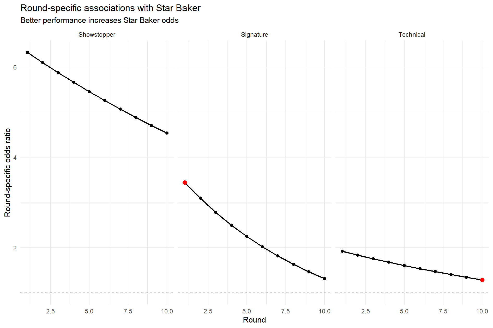
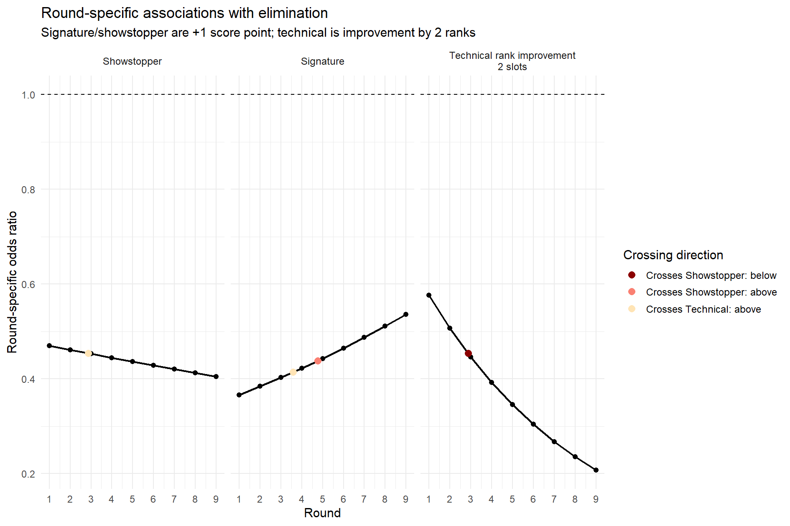

# *The Great British Stats Off*: A Statistical Look at *The Great British Bake Off*, Series 5–12 on Netflix

---

> **What really stands out in the tent?**

> **Who were the strongest contenders?**

These are the kinds of questions I had after watching Series 5–12 of *The Great British Bake Off* on Netflix. I wanted to see whether my general impressions about specific events, like the beloved Jürgen being eliminated, or broader judging patterns, like Showstopper performance seeming to dominate, were also supported by the data.

Using data prepared by [Nathan Giusti](https://github.com/nathangiusti/BakeOff), I focus on four questions:

1. Which parts of the competition are most associated with Star Baker?
2. Which parts are most associated with avoiding elimination?
3. How well can simple within-episode models predict judging decisions?
4. Which bakers and seasons stand out after adjustment?

The basic idea is that *Bake Off* is not a collection of independent scores. Each week, the relevant comparison is among the bakers still competing in that episode, not across unrelated weeks or seasons. That structure matters: a baker can have a good week and still be in danger if several others were better, or survive a mediocre week if someone else had a worse one. Basic descriptive statistics can be helpful, but they do not fully respect this setup. So I treat judging as a within-episode comparison problem using two complementary models: a conditional logistic regression model conditioned on episode for the weekly Star Baker and elimination decisions, and a linear mixed-effects model with random effects for episode and contestant, plus a fixed effect for series, to summarize adjusted baker- and season-level performance.

---

## Question 1: How Well Can We Predict Star Baker and Elimination?

The conditional-logit models perform reasonably well at predicting who will be Star Baker or eliminated in a given episode, using leave-one-episode-out cross-validation. For elimination, Round 10 is excluded because the final does not have a standard weekly elimination decision.

<strong>Prediction accuracy: leave-one-episode-out cross-validation</strong>

<table align="center" cellpadding="10" cellspacing="0" style="border-collapse: collapse; margin-left: auto; margin-right: auto;">
  <thead>
    <tr>
      <th align="left" style="padding-left: 18px; padding-right: 18px;">Outcome</th>
      <th align="center" style="padding-left: 18px; padding-right: 18px;">Top-1 Accuracy</th>
      <th align="center" style="padding-left: 18px; padding-right: 18px;">Top-2 Accuracy</th>
      <th align="center" style="padding-left: 18px; padding-right: 18px;">Top-3 Accuracy</th>
    </tr>
  </thead>
  <tbody>
    <tr>
      <td align="left" style="padding-left: 18px; padding-right: 18px;">Star Baker</td>
      <td align="center" style="padding-left: 18px; padding-right: 18px;"><strong>67.5%</strong></td>
      <td align="center" style="padding-left: 18px; padding-right: 18px;"><strong>87.5%</strong></td>
      <td align="center" style="padding-left: 18px; padding-right: 18px;"><strong>98.8%</strong></td>
    </tr>
    <tr>
      <td align="left" style="padding-left: 18px; padding-right: 18px;">Elimination</td>
      <td align="center" style="padding-left: 18px; padding-right: 18px;"><strong>56.9%</strong></td>
      <td align="center" style="padding-left: 18px; padding-right: 18px;"><strong>80.6%</strong></td>
      <td align="center" style="padding-left: 18px; padding-right: 18px;"><strong>95.8%</strong></td>
    </tr>
  </tbody>
</table>

Immediately:

- For Star Baker, the model ranks the actual Star Baker first in 67.5% of held-out episodes, in the top two in 87.5%, and in the top three in 98.8%.
  - Restricting to the eight finale episodes, the model ranks the eventual series winner highest among the finalists in six out of eight seasons in the dataset: **75% of the time**, using cross-validation where the final episode itself is held out.
- For elimination, excluding Round 10, the model ranks the eliminated baker first in 56.9% of held-out episodes, in the top two in 80.6%, and in the top three in 95.8%.

Discrimination is also strong.

<strong>Discrimination metrics</strong>

<table align="center" cellpadding="10" cellspacing="0" style="border-collapse: collapse; margin-left: auto; margin-right: auto;">
  <thead>
    <tr>
      <th align="left" style="padding-left: 22px; padding-right: 22px;">Outcome</th>
      <th align="center" style="padding-left: 22px; padding-right: 22px;">AUROC</th>
      <th align="center" style="padding-left: 22px; padding-right: 22px;">AUPRC</th>
    </tr>
  </thead>
  <tbody>
    <tr>
      <td align="left" style="padding-left: 22px; padding-right: 22px;">Star Baker</td>
      <td align="center" style="padding-left: 22px; padding-right: 22px;"><strong>0.941</strong></td>
      <td align="center" style="padding-left: 22px; padding-right: 22px;"><strong>0.680</strong></td>
    </tr>
    <tr>
      <td align="left" style="padding-left: 22px; padding-right: 22px;">Elimination</td>
      <td align="center" style="padding-left: 22px; padding-right: 22px;"><strong>0.918</strong></td>
      <td align="center" style="padding-left: 22px; padding-right: 22px;"><strong>0.561</strong></td>
    </tr>
  </tbody>
</table>

- AUROC has a direct ranking interpretation: it is the probability that the model assigns a higher predicted probability to a randomly selected true event case than to a randomly selected non-event case.
  - For Star Baker, AUROC is the probability that an actual Star Baker is ranked above a non-Star Baker by predicted Star Baker probability.
  - For elimination, AUROC is the probability that an eliminated baker is ranked above a non-eliminated baker by predicted elimination probability.

- AUPRC summarizes the precision-recall tradeoff.
  - Precision asks: among the bakers the model assigns high predicted probability, how many were actually selected?
  - Recall asks: among the bakers who were actually selected, how many did the model successfully flag?
  - This is especially relevant here because each episode has only one Star Baker and usually one eliminated baker, so the event class is rare within each weekly risk set.

Together, AUROC and AUPRC indicate that the models do reasonably well predicting both elimination and Star Baker, or at least identifying who is seriously in contention by the top two or top three rankings. Star Baker seems a bit easier to predict than elimination. This makes sense. Star Baker often goes to the obvious standout, while elimination is usually a close call among weaker performances and can depend heavily on episode-specific context.

---

## Question 2: Which Challenges Matter Most for Star Baker?

  

The result is in the units: **the Showstopper dominates Star Baker selection**.

- The fitted odds ratio corresponds to the change in the odds of receiving Star Baker for a one-unit increase in the Showstopper sum score, holding the baker's other modeled scores fixed and comparing within the same episode risk set.
  - The Showstopper score is the sum of the flavor, taste, and bake components.
  - So a one-unit increase has a concrete interpretation: one component moves up by one scoring level, for example from neutral $(0)$ to good $(1)$ in Showstopper flavor, holding the other components fixed.

- Signature and Technical performance still matter, but mainly as supporting evidence. If the question is who wins Star Baker, the Showstopper is usually doing the most work.

- In fact just looking at those with the highest showstopper sums in each round, $88.7\%$ of the time this group (if there are more than one perfect showstopper) this group contains the star baker! So we honestly dont need fancy models for star baker prediction
---

## Question 3: Which Challenges Matter Most for Avoiding Elimination?

  

The elimination model gives a different but compatible picture. For elimination, the model is fit only on Rounds 1--9, excluding the final.

**Signature performance is most protective early. Showstopper performance becomes more important around the middle and later parts of the competition.**

This is consistent with the structure of the show:

- Early rounds contain larger risk sets, and the Signature gives judges an initial view of whether a baker is competent and stable.
- Later rounds are more selective, and the Showstopper becomes harder to ignore.
- The Technical plays a role, but it is usually not enough by itself to override a bad Showstopper.

So the two judging models tell a coherent story:

- For Star Baker, the Showstopper is the dominant signal.
- For elimination, the Showstopper matters a lot, but early Signature performance is especially protective.
- The Technical matters, but it is rarely the main driver by itself.

## Question 4: Which Bakers and Series Stand Out?

The second model, a linear mixed-effects model, estimates a fitted baker effect for each baker-season combination. This is a season-long performance offset: how much better or worse the baker tended to score than the model baseline after accounting for series, episode, and component type.

A few caveats matter:

- These are season-long summaries, not winner labels.
- Early eliminees have less data, so their estimates are less stable. A low effect for someone eliminated in the first few weeks should not be overinterpreted.
- The interesting cases are mismatches: strong season-long bakers who did not win, and winners who were not the model's top season-long performer.

So the baker effects should be read as:

- adjusted season-long performance summaries;
- useful for finding mismatch cases;
- not definitive all-time rankings.

---

### Strongest Fitted Baker Effects

<strong>Top 10 bakers by fitted effect</strong>

<table align="center" cellpadding="10" cellspacing="0" style="border-collapse: collapse; margin-left: auto; margin-right: auto;">
  <thead>
    <tr>
      <th align="center" style="padding-left: 18px; padding-right: 18px;">#</th>
      <th align="left" style="padding-left: 24px; padding-right: 24px;">Baker</th>
      <th align="center" style="padding-left: 18px; padding-right: 18px;">Series</th>
      <th align="center" style="padding-left: 18px; padding-right: 18px;">Effect</th>
    </tr>
  </thead>
  <tbody>
    <tr><td align="center" style="padding-left: 18px; padding-right: 18px;">1</td><td align="left" style="padding-left: 24px; padding-right: 24px;">Sophie</td><td align="center" style="padding-left: 18px; padding-right: 18px;">5</td><td align="center" style="padding-left: 18px; padding-right: 18px;">+0.336</td></tr>
    <tr><td align="center" style="padding-left: 18px; padding-right: 18px;">2</td><td align="left" style="padding-left: 24px; padding-right: 24px;">Giuseppe</td><td align="center" style="padding-left: 18px; padding-right: 18px;">9</td><td align="center" style="padding-left: 18px; padding-right: 18px;">+0.325</td></tr>
    <tr><td align="center" style="padding-left: 18px; padding-right: 18px;">3</td><td align="left" style="padding-left: 24px; padding-right: 24px;">Syabira</td><td align="center" style="padding-left: 18px; padding-right: 18px;">10</td><td align="center" style="padding-left: 18px; padding-right: 18px;">+0.308</td></tr>
    <tr><td align="center" style="padding-left: 18px; padding-right: 18px;">4</td><td align="left" style="padding-left: 24px; padding-right: 24px;">Crystelle</td><td align="center" style="padding-left: 18px; padding-right: 18px;">9</td><td align="center" style="padding-left: 18px; padding-right: 18px;">+0.294</td></tr>
    <tr><td align="center" style="padding-left: 18px; padding-right: 18px;">5</td><td align="left" style="padding-left: 24px; padding-right: 24px;">Steph</td><td align="center" style="padding-left: 18px; padding-right: 18px;">7</td><td align="center" style="padding-left: 18px; padding-right: 18px;">+0.292</td></tr>
    <tr><td align="center" style="padding-left: 18px; padding-right: 18px;">6</td><td align="left" style="padding-left: 24px; padding-right: 24px;">Jürgen</td><td align="center" style="padding-left: 18px; padding-right: 18px;">9</td><td align="center" style="padding-left: 18px; padding-right: 18px;">+0.251</td></tr>
    <tr><td align="center" style="padding-left: 18px; padding-right: 18px;">7</td><td align="left" style="padding-left: 24px; padding-right: 24px;">Peter</td><td align="center" style="padding-left: 18px; padding-right: 18px;">8</td><td align="center" style="padding-left: 18px; padding-right: 18px;">+0.248</td></tr>
    <tr><td align="center" style="padding-left: 18px; padding-right: 18px;">8</td><td align="left" style="padding-left: 24px; padding-right: 24px;">Chigs</td><td align="center" style="padding-left: 18px; padding-right: 18px;">9</td><td align="center" style="padding-left: 18px; padding-right: 18px;">+0.248</td></tr>
    <tr><td align="center" style="padding-left: 18px; padding-right: 18px;">9</td><td align="left" style="padding-left: 24px; padding-right: 24px;">Josh</td><td align="center" style="padding-left: 18px; padding-right: 18px;">11</td><td align="center" style="padding-left: 18px; padding-right: 18px;">+0.244</td></tr>
    <tr><td align="center" style="padding-left: 18px; padding-right: 18px;">10</td><td align="left" style="padding-left: 24px; padding-right: 24px;">Rahul</td><td align="center" style="padding-left: 18px; padding-right: 18px;">6</td><td align="center" style="padding-left: 18px; padding-right: 18px;">+0.235</td></tr>
  </tbody>
</table>

The top of the list passes a basic validity check:

- Sophie, Giuseppe, Syabira, Peter, and Rahul all won.
- Crystelle, Steph, Chigs, and Josh all reached the final.
- Jürgen is the obvious exception: very high fitted effect, semifinal exit.

The bottom of the list should be read much more cautiously, so I leave it out of this README. Many of those bakers left early, so the model has very little information on them.

These effects also track elimination:

- Bakers with larger fitted effects tended to survive longer, even though the baker effects were estimated from judging scores and not from elimination outcomes.
- But the relationship should not be perfect as bakers are not eliminated based on their average performance. Instead they are eliminated based on the current week, conditional on who is still in the tent.

That is exactly why the mismatch cases are interesting.

---

### Winners and Their Season-Long Rankings

<strong>Series winners by fitted effect and within-season rank</strong>

<table align="center" cellpadding="10" cellspacing="0" style="border-collapse: collapse; margin-left: auto; margin-right: auto;">
  <thead>
    <tr>
      <th align="center" style="padding-left: 18px; padding-right: 18px;">Series</th>
      <th align="left" style="padding-left: 24px; padding-right: 24px;">Winner</th>
      <th align="center" style="padding-left: 18px; padding-right: 18px;">Estimated Effect</th>
      <th align="center" style="padding-left: 18px; padding-right: 18px;">Within-Season Rank</th>
    </tr>
  </thead>
  <tbody>
    <tr><td align="center" style="padding-left: 18px; padding-right: 18px;">5</td><td align="left" style="padding-left: 24px; padding-right: 24px;">Sophie</td><td align="center" style="padding-left: 18px; padding-right: 18px;">+0.336</td><td align="center" style="padding-left: 18px; padding-right: 18px;"><strong>1st of 12</strong></td></tr>
    <tr><td align="center" style="padding-left: 18px; padding-right: 18px;">6</td><td align="left" style="padding-left: 24px; padding-right: 24px;">Rahul</td><td align="center" style="padding-left: 18px; padding-right: 18px;">+0.235</td><td align="center" style="padding-left: 18px; padding-right: 18px;"><strong>1st of 12</strong></td></tr>
    <tr><td align="center" style="padding-left: 18px; padding-right: 18px;">7</td><td align="left" style="padding-left: 24px; padding-right: 24px;">David</td><td align="center" style="padding-left: 18px; padding-right: 18px;">+0.178</td><td align="center" style="padding-left: 18px; padding-right: 18px;"><strong>2nd of 13</strong></td></tr>
    <tr><td align="center" style="padding-left: 18px; padding-right: 18px;">8</td><td align="left" style="padding-left: 24px; padding-right: 24px;">Peter</td><td align="center" style="padding-left: 18px; padding-right: 18px;">+0.248</td><td align="center" style="padding-left: 18px; padding-right: 18px;"><strong>1st of 12</strong></td></tr>
    <tr><td align="center" style="padding-left: 18px; padding-right: 18px;">9</td><td align="left" style="padding-left: 24px; padding-right: 24px;">Giuseppe</td><td align="center" style="padding-left: 18px; padding-right: 18px;">+0.325</td><td align="center" style="padding-left: 18px; padding-right: 18px;"><strong>1st of 12</strong></td></tr>
    <tr><td align="center" style="padding-left: 18px; padding-right: 18px;">10</td><td align="left" style="padding-left: 24px; padding-right: 24px;">Syabira</td><td align="center" style="padding-left: 18px; padding-right: 18px;">+0.308</td><td align="center" style="padding-left: 18px; padding-right: 18px;"><strong>1st of 12</strong></td></tr>
    <tr><td align="center" style="padding-left: 18px; padding-right: 18px;">11</td><td align="left" style="padding-left: 24px; padding-right: 24px;">Matty</td><td align="center" style="padding-left: 18px; padding-right: 18px;">−0.000</td><td align="center" style="padding-left: 18px; padding-right: 18px;"><strong>7th of 12</strong></td></tr>
    <tr><td align="center" style="padding-left: 18px; padding-right: 18px;">12</td><td align="left" style="padding-left: 24px; padding-right: 24px;">Georgie</td><td align="center" style="padding-left: 18px; padding-right: 18px;">+0.071</td><td align="center" style="padding-left: 18px; padding-right: 18px;"><strong>5th of 11</strong></td></tr>
  </tbody>
</table>

The pattern is pretty clear:

- In six of eight seasons, the winner was ranked first in their season by the fitted baker effect. (this agrees with the perfomrance from our conditional logistic model)
- David was second in Series 7.
- The clear exceptions are Matty and Georgie.

Matty is the strongest outlier. His fitted effect is essentially average for Series 11, ranking 7th of 12. Josh looks like the stronger season-long baker by this model, but Matty won the final.

Georgie is similar but less extreme. She ranks 5th in Series 12, while Gill ranks first. Again, this is not a contradiction. It is the difference between season-long fitted performance and winning the final episode.

That distinction is the whole point. Sometimes the winner is also the strongest season-long baker. Sometimes the final changes the story.

---

### Strong Bakers Who Did Not Win

These are the cases where the model and the final outcome diverge most clearly.

<strong>High-ranked non-winners by fitted effect</strong>

<table align="center" cellpadding="10" cellspacing="0" style="border-collapse: collapse; margin-left: auto; margin-right: auto;">
  <thead>
    <tr>
      <th align="center" style="padding-left: 18px; padding-right: 18px;">Series</th>
      <th align="left" style="padding-left: 24px; padding-right: 24px;">Baker</th>
      <th align="center" style="padding-left: 18px; padding-right: 18px;">Effect</th>
      <th align="center" style="padding-left: 18px; padding-right: 18px;">Season Rank</th>
      <th align="left" style="padding-left: 24px; padding-right: 24px;">Eliminated</th>
    </tr>
  </thead>
  <tbody>
    <tr><td align="center" style="padding-left: 18px; padding-right: 18px;">9</td><td align="left" style="padding-left: 24px; padding-right: 24px;">Crystelle</td><td align="center" style="padding-left: 18px; padding-right: 18px;">+0.294</td><td align="center" style="padding-left: 18px; padding-right: 18px;">2nd of 12</td><td align="left" style="padding-left: 24px; padding-right: 24px;">Episode 10 (Final)</td></tr>
    <tr><td align="center" style="padding-left: 18px; padding-right: 18px;">7</td><td align="left" style="padding-left: 24px; padding-right: 24px;">Steph</td><td align="center" style="padding-left: 18px; padding-right: 18px;">+0.292</td><td align="center" style="padding-left: 18px; padding-right: 18px;"><strong>1st of 13</strong></td><td align="left" style="padding-left: 24px; padding-right: 24px;">Episode 10 (Final)</td></tr>
    <tr><td align="center" style="padding-left: 18px; padding-right: 18px;">9</td><td align="left" style="padding-left: 24px; padding-right: 24px;">Jürgen</td><td align="center" style="padding-left: 18px; padding-right: 18px;">+0.251</td><td align="center" style="padding-left: 18px; padding-right: 18px;">3rd of 12</td><td align="left" style="padding-left: 24px; padding-right: 24px;">Episode 9 (Semi-final)</td></tr>
    <tr><td align="center" style="padding-left: 18px; padding-right: 18px;">9</td><td align="left" style="padding-left: 24px; padding-right: 24px;">Chigs</td><td align="center" style="padding-left: 18px; padding-right: 18px;">+0.248</td><td align="center" style="padding-left: 18px; padding-right: 18px;">4th of 12</td><td align="left" style="padding-left: 24px; padding-right: 24px;">Episode 10 (Final)</td></tr>
    <tr><td align="center" style="padding-left: 18px; padding-right: 18px;">11</td><td align="left" style="padding-left: 24px; padding-right: 24px;">Josh</td><td align="center" style="padding-left: 18px; padding-right: 18px;">+0.244</td><td align="center" style="padding-left: 18px; padding-right: 18px;"><strong>1st of 12</strong></td><td align="left" style="padding-left: 24px; padding-right: 24px;">Episode 10 (Final)</td></tr>
    <tr><td align="center" style="padding-left: 18px; padding-right: 18px;">6</td><td align="left" style="padding-left: 24px; padding-right: 24px;">Kim-Joy</td><td align="center" style="padding-left: 18px; padding-right: 18px;">+0.224</td><td align="center" style="padding-left: 18px; padding-right: 18px;">2nd of 12</td><td align="left" style="padding-left: 24px; padding-right: 24px;">Episode 10 (Final)</td></tr>
    <tr><td align="center" style="padding-left: 18px; padding-right: 18px;">11</td><td align="left" style="padding-left: 24px; padding-right: 24px;">Tasha</td><td align="center" style="padding-left: 18px; padding-right: 18px;">+0.213</td><td align="center" style="padding-left: 18px; padding-right: 18px;">2nd of 12</td><td align="left" style="padding-left: 24px; padding-right: 24px;">Episode 9 (Semi-final)</td></tr>
    <tr><td align="center" style="padding-left: 18px; padding-right: 18px;">12</td><td align="left" style="padding-left: 24px; padding-right: 24px;">Gill</td><td align="center" style="padding-left: 18px; padding-right: 18px;">+0.192</td><td align="center" style="padding-left: 18px; padding-right: 18px;"><strong>1st of 11</strong></td><td align="left" style="padding-left: 24px; padding-right: 24px;">Episode 9 (Semi-final)</td></tr>
    <tr><td align="center" style="padding-left: 18px; padding-right: 18px;">10</td><td align="left" style="padding-left: 24px; padding-right: 24px;">Maxy</td><td align="center" style="padding-left: 18px; padding-right: 18px;">+0.158</td><td align="center" style="padding-left: 18px; padding-right: 18px;">2nd of 12</td><td align="left" style="padding-left: 24px; padding-right: 24px;">Episode 8</td></tr>
    <tr><td align="center" style="padding-left: 18px; padding-right: 18px;">8</td><td align="left" style="padding-left: 24px; padding-right: 24px;">Lottie</td><td align="center" style="padding-left: 18px; padding-right: 18px;">+0.139</td><td align="center" style="padding-left: 18px; padding-right: 18px;">3rd of 12</td><td align="left" style="padding-left: 24px; padding-right: 24px;">Episode 7</td></tr>
  </tbody>
</table>

- Jürgen is the obvious case. He ranks near the top of the full dataset and third in Series 9, but he left in the semifinal. His elimination generated more than 100 Ofcom complaints. The model is not saying the judges were wrong; it is saying that his season-long fitted profile was much stronger than his final placement.

- Steph ranks first in Series 7, ahead of David, but lost in the final. That matches the common interpretation of her season: very strong across the run, poor final relative to her usual level.

- Josh has the same structure in Series 11. He ranks first in the season by fitted effect. Matty won. That reads as a final-day reversal, not season-long dominance by Matty.

- Tasha and Gill are the clean semifinal cases in the later seasons. Both had high fitted effects and both left one week before the final. Gill is especially notable because she is the model's top baker in Series 12 despite Georgie winning.

---

### Season Balance: Which Seasons Had the Strongest Fields?

We can also look at each series by how spread out the fitted baker effects are. This is a rough way to measure how separated the strongest and weakest bakers were in each season.

- A larger spread means a bigger gap between the top and bottom of the field.
- A smaller spread means a more compressed season.
- The “Top-4 minus Bottom-4 Mean” column compares the average fitted effect among the top four bakers in a series to the average fitted effect among the bottom four.

<strong>Season-level spread of fitted baker effects</strong>

<table align="center" cellpadding="10" cellspacing="0" style="border-collapse: collapse; margin-left: auto; margin-right: auto;">
  <thead>
    <tr>
      <th align="center" style="padding-left: 18px; padding-right: 18px;">Series</th>
      <th align="center" style="padding-left: 18px; padding-right: 18px;">SD of Effects</th>
      <th align="center" style="padding-left: 18px; padding-right: 18px;">Full Range</th>
      <th align="center" style="padding-left: 18px; padding-right: 18px;">Top-4 minus Bottom-4 Mean</th>
    </tr>
  </thead>
  <tbody>
    <tr><td align="center" style="padding-left: 18px; padding-right: 18px;"><strong>9</strong></td><td align="center" style="padding-left: 18px; padding-right: 18px;"><strong>0.224</strong></td><td align="center" style="padding-left: 18px; padding-right: 18px;"><strong>0.598</strong></td><td align="center" style="padding-left: 18px; padding-right: 18px;"><strong>0.502</strong></td></tr>
    <tr><td align="center" style="padding-left: 18px; padding-right: 18px;">10</td><td align="center" style="padding-left: 18px; padding-right: 18px;">0.180</td><td align="center" style="padding-left: 18px; padding-right: 18px;">0.573</td><td align="center" style="padding-left: 18px; padding-right: 18px;">0.375</td></tr>
    <tr><td align="center" style="padding-left: 18px; padding-right: 18px;">7</td><td align="center" style="padding-left: 18px; padding-right: 18px;">0.158</td><td align="center" style="padding-left: 18px; padding-right: 18px;">0.526</td><td align="center" style="padding-left: 18px; padding-right: 18px;">0.357</td></tr>
    <tr><td align="center" style="padding-left: 18px; padding-right: 18px;">12</td><td align="center" style="padding-left: 18px; padding-right: 18px;">0.158</td><td align="center" style="padding-left: 18px; padding-right: 18px;">0.598</td><td align="center" style="padding-left: 18px; padding-right: 18px;">0.261</td></tr>
    <tr><td align="center" style="padding-left: 18px; padding-right: 18px;">8</td><td align="center" style="padding-left: 18px; padding-right: 18px;">0.154</td><td align="center" style="padding-left: 18px; padding-right: 18px;">0.502</td><td align="center" style="padding-left: 18px; padding-right: 18px;">0.332</td></tr>
    <tr><td align="center" style="padding-left: 18px; padding-right: 18px;">11</td><td align="center" style="padding-left: 18px; padding-right: 18px;">0.154</td><td align="center" style="padding-left: 18px; padding-right: 18px;">0.496</td><td align="center" style="padding-left: 18px; padding-right: 18px;">0.324</td></tr>
    <tr><td align="center" style="padding-left: 18px; padding-right: 18px;">5</td><td align="center" style="padding-left: 18px; padding-right: 18px;">0.149</td><td align="center" style="padding-left: 18px; padding-right: 18px;">0.542</td><td align="center" style="padding-left: 18px; padding-right: 18px;">0.297</td></tr>
    <tr><td align="center" style="padding-left: 18px; padding-right: 18px;">6</td><td align="center" style="padding-left: 18px; padding-right: 18px;">0.141</td><td align="center" style="padding-left: 18px; padding-right: 18px;">0.410</td><td align="center" style="padding-left: 18px; padding-right: 18px;">0.308</td></tr>
  </tbody>
</table>

- Series 9 stands out across every measure. Giuseppe, Crystelle, Jürgen, and Chigs all rank near the top of the full dataset. That looks like an unusually strong top cluster, not just one dominant winner.

- Series 12 has a large full range, but that is partly driven by Hazel's very early exit and unstable low estimate. The top of the season is strong, but less concentrated than Series 9, and the eventual winner is not the model's top baker.

- Series 6 is the most compressed season by standard deviation and full range. The model sees less separation between the strongest and weakest bakers in that cast.

---

## Limitations

Given the conclusions above, the main limitation is simple: the models are observational, and subject to the data collection process and possible issues therin. However, they are still *models* subject to assumptions.

What they do:

- estimate associations between scored performance and judging outcomes;
- compare bakers within the relevant episode-level risk set;
- summarize season-long adjusted baker performance.

What they do **not** do:

- estimate causal effects;
- remove dependence on score coding, cleaning choices, or model specification;
- capture improvement, fatigue, pressure, personalities, or the final-week structure of the show.

Still, they are useful. They give a transparent way to separate weekly judging decisions from season-long performance summaries. That is enough to explain why cases like Jürgen, Steph, Josh, Matty, Georgie, and Gill are interesting.

---

## Technical Notes

**Model 1: conditional logistic regression**

- Compares bakers within each episode's risk set.
- Models the weekly Star Baker and elimination decisions. since those who do not win in the finale are elinated we do not include the finale in the elimination models.
- Uses Signature and Showstopper scores formed from bake, flavour, and appearance components.
- Puts Signature and Showstopper scores on an approximately [−3, 3] scale.
- Transforms Technical performance from a within-episode rank into a comparable scaled score.

**Model 2: linear mixed-effects model**

- Uses individual scoring components stacked in long format.
- Includes fixed effects for component type and series.
- Includes random intercepts for baker and episode.
- Produces the baker effects used as the main season-long summaries.

**Cross-validation**

- Uses leave-one-episode-out cross-validation.
- Predicts each held-out episode using a model trained on all other episodes.
- Includes earlier episodes from the same season in the training data.
- A stricter leave-one-series-out evaluation would ask whether the model generalizes to an entirely unseen season.

**Requirements**

- R 4.0+
- `tidyverse`
- `survival`
- `lme4`
- `broom`
- `broom.mixed`
- `ggplot2`